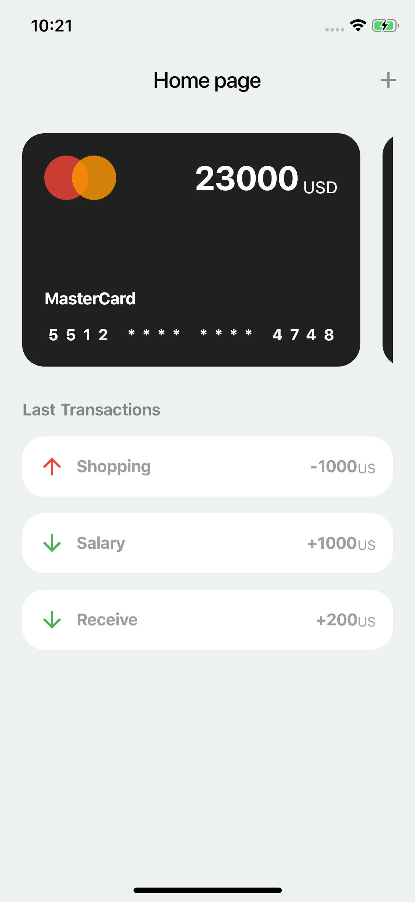
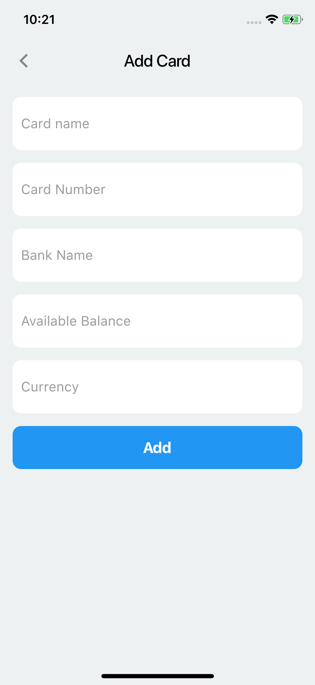

# Flutter Expense Manager Application

The Expense Manager Application, using Provider to manage state.

A Flutter sample app that shows a state management approach using the Provider package and shared preferences for saving data in mobile.

## Screenshot

