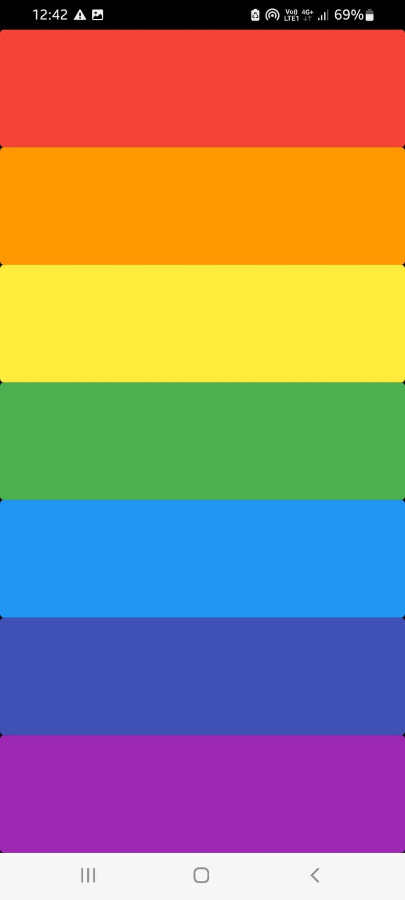

# Xylophone App🎶

This is a simple Xylophone app built with Flutter. It allows users to play musical notes by tapping on colorful bars on the screen.

## Features

- Seven different musical notes represented by colorful bars
- Produces sound when the bars are tapped
- Responsive layout for various screen sizes

## Screenshots



## Screen-recording

<video height="400px" controls>
  <source src="xylophone_vid.mp4" type="video/mp4">
</video>

## Getting Started

To get started with this project, follow these steps:

1. Ensure that you have Flutter installed. If not, refer to the official Flutter documentation for installation instructions.

2. Clone this repository to your local machine:

   ```
   git clone <url>
   ```

3. Open the project in your preferred IDE or text editor.

4. Run the following command in your terminal to fetch the project dependencies:

   ```
   flutter pub get
   ```

5. Connect your device or start an emulator.

6. Run the app using the following command:

   ```
   flutter run
   ```

7. The app should now be running on your device or emulator. Play the musical notes by tapping on the colorful bars on the screen.

## Dependencies

List any third-party dependencies used in your project, along with the version numbers. For example:

- `flutter: ^2.2.1`
- `audioplayers: ^0.19.1`

## Contributing

Contributions are welcome! If you encounter any issues or have suggestions for improvement, please open an issue or submit a pull request.

## Author

#### Avantika Pandey
- LinkedIN: https://www.linkedin.com/in/avantika-pandey-2759941ab
- GitHub: https://github.com/codewithavantika

