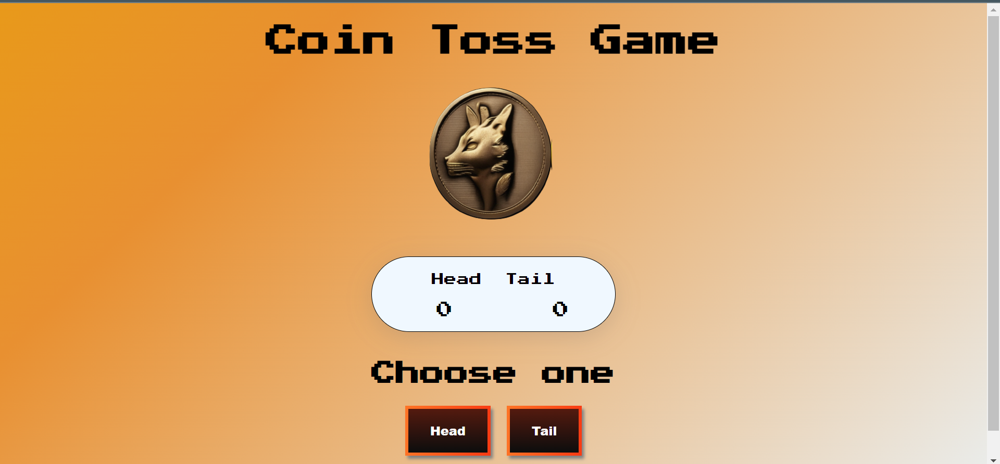
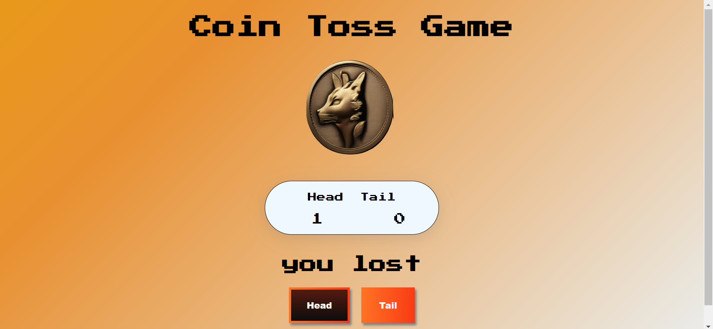
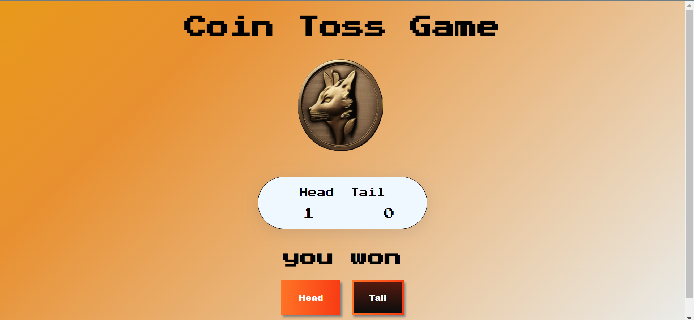

# Coin flip Game 🪙

# What is it?
As the name suggest this is a small game where the user selects from the head and tail button to spin the coin and when the coi stops then it tells whether head came or tail and hence the user won or lost.

## Tech Stack used
- HTML 
- CSS 
- Javascript and
- Basics of JQuery.

## Features
- Tosses the coin randomly to get a head or tail as a game.
- Gives the count about how many times a head came or tail came.

## Demo images of the project

---

---

---

---

## How to run it locally?
- Fork the repository.
- Clone the repository by using the command:-
---
    git clone [github url of the repository]

- go to the directory of the project using command:-
---
    cd [path of the project folder]
    
- Open the index.html file in any browser and see it running :)

### Thank you :)

