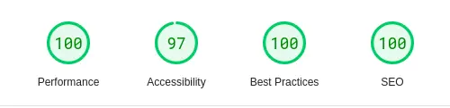

<h2 align="center">Intro Component with Sign up form</h2>

 
 

## **Preview**

 

## Pagespeed Insights Score:

- | Scored 99.25% on Pagespeed Insights |
  | :-----: |
  |  |
  |  |
  | Check out [**Pagespeed Insights**](https://pagespeed.web.dev/analysis/https-0xabdulkhalid-github-io-intro-component-with-sign-up-form/opfplx6sxw?form_factor=desktop) to get live score |
  |||

 

## **Built With**

-    
-  
-   

 

## **Tools Used**

- 
-   
- 
-    

 
