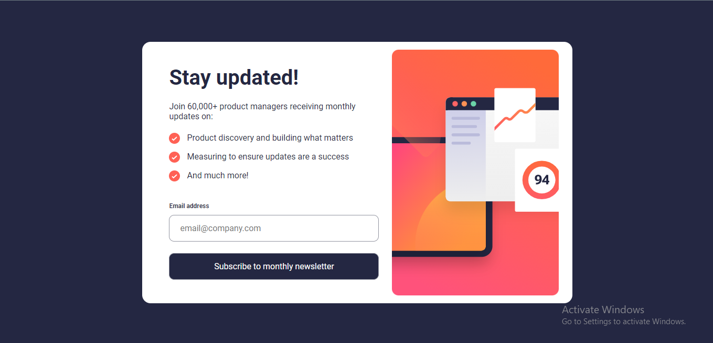
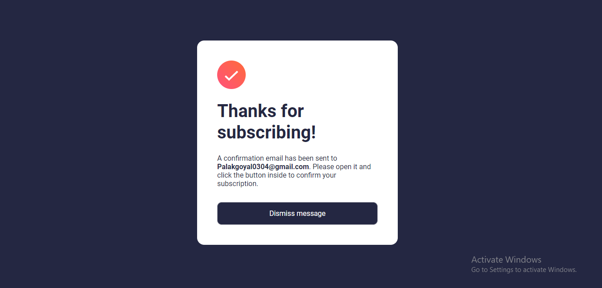
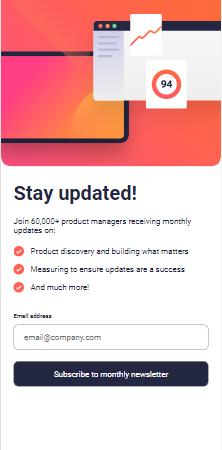
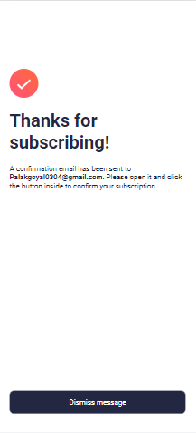
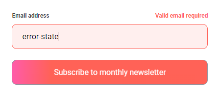

# Newsletter sign-up form with success message solution

This is a solution to the [Newsletter sign-up form with success message challenge on Frontend Mentor](https://www.frontendmentor.io/challenges/newsletter-signup-form-with-success-message-3FC1AZbNrv). Frontend Mentor challenges help you improve your coding skills by building realistic projects. 

## Table of contents

- [Overview](#overview)
  - [The challenge](#the-challenge)
  - [Screenshot](#screenshot)
  - [Links](#links)
- [My process](#my-process)
  - [Built with](#built-with)
  - [What I learned](#what-i-learned)
  - [Continued development](#continued-development)
  - [Useful resources](#useful-resources)
- [Author](#author)
- [Acknowledgments](#acknowledgments)

## Overview

### The challenge

Users should be able to:

- Add their email and submit the form
- See a success message with their email after successfully submitting the form
- See form validation messages if:
  - The field is left empty
  - The email address is not formatted correctly
- View the optimal layout for the interface depending on their device's screen size
- See hover and focus states for all interactive elements on the page

### Screenshot







### Links

- Solution URL: [Add solution URL here](https://your-solution-url.com)
- Live Site URL: [Add live site URL here](https://your-live-site-url.com)

## My process

### Built with

- Semantic HTML5 markup
- CSS custom properties
- Flexbox
- Mobile-first workflow
- JavaScript

### What I learned

I have used JS for manipulating DOM very less. So, by creating this project I have learned how to manipulate DOM using JS. I have also learned how to use regular expressions for validating email address. I have learnt about regex a few days ago and this project gave me a chance to understand how it is used in real world projects.
The main giveaway of every project in Frontend mentor is that it let me make a README file on my own by giving a template.

```html
<h1>Some JS code I'm proud of</h1>
```

```js
function ValidateEmail(inputText) {
    const mailformat = /^\w+([\.-]?\w+)*@\w+([\.-]?\w+)*(\.\w{2,3})+$/;
    if (inputText.value.match(mailformat)) {
        successEmail.innerHTML = inputText.value;

        input.classList.remove('error-state');
        errorMsg.classList.remove('show');
        successMsgContainer.classList.add('show');
        successMsgContainer.classList.remove('hide');
        container.classList.add('hide');
        container.classList.remove('show');
        return true;
    }
    else {
        input.classList.add('error-state');
        errorMsg.classList.add('show');
        successMsgContainer.classList.remove('show');
        successMsgContainer.classList.add('hide');
        container.classList.remove('hide');
        container.classList.add('show');
        return false;
    }
}

```

### Continued development

I mainly work on projects that include libraries like React and framework like Tailwind. So, I haven't spend that much time with vanilla CSS and vanilla JS. Hence, I would work on both in the future more.

### Useful resources

- [Simplilearn](https://www.simplilearn.com/tutorials/javascript-tutorial/email-validation-in-javascript) - This helped me for with the implementation of regex for email validation.

## Author

- Website - [Palak Goyal](https://github.com/Palakkgoyal)
- Frontend Mentor - [@Palakkgoyal](https://www.frontendmentor.io/profile/Palakkgoyal)
- Twitter - [@Palaktwts](https://twitter.com/Palaktwts)

## Acknowledgments

I would like to thank Frontend Mentor for providing me with this opportunity to work on this project. I would also like to thank Simplilearn for providing me with the resources to learn regex.