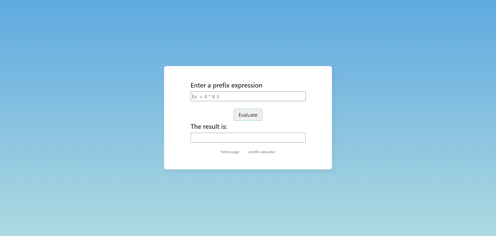
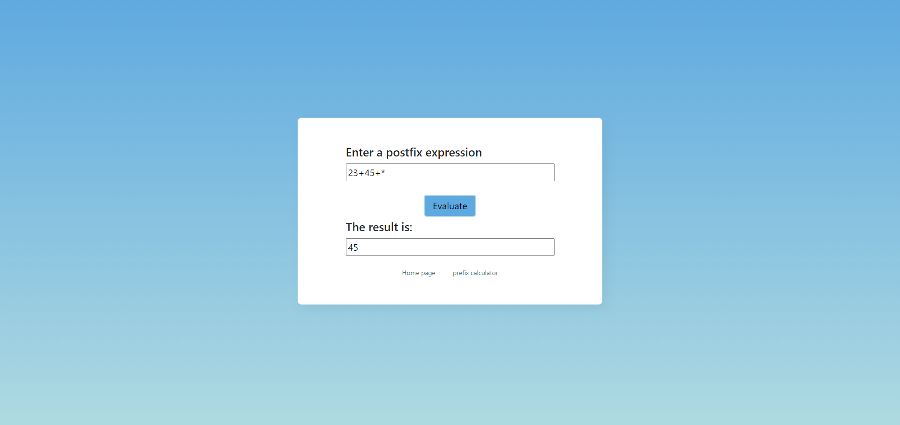

# Prefix and Postfix Expression Calculator

## About

Prefix and Postfix Calculator is a simple web application that takes prefix and postfix expression from user and evaluates it.
It's UI is very simple consisting of three pages. 
The landing page consists of two buttons, one is prefix and another is of postfix calculator. Clicking on any of them, the user will be taken to that calculator.
The Prefix calculator page has an input box that asks the users to enter prefix expression and the evaluate button that evaluates the expression and show the result in the result box.

## Screenshots

### Landing page
The Sreenshot of the landing page.

### prefix expression calculator

The screenshot of the prefix calculator page.

### postfix expression calculator

The screenshot of the posfix calculator page.

## Tech stack used

## frontend

[HTML](https://img.shields.io/badge/html5%20-%23E34F26.svg?&style=for-the-badge&logo=html5&logoColor=white")
[CSS](https://img.shields.io/badge/css3%20-%231572B6.svg?&style=for-the-badge&logo=css3&logoColor=white)
[Javascript](https://img.shields.io/badge/javascript%20-%23323330.svg?&style=for-the-badge&logo=javascript&logoColor=%23F7DF1E)
