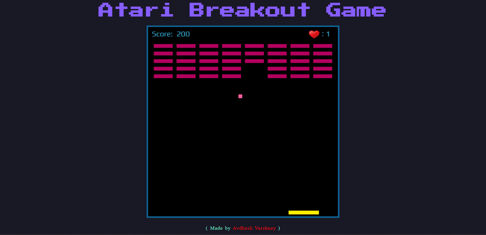
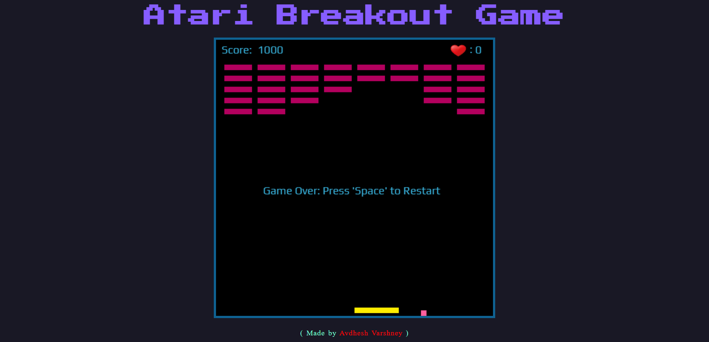

# **Atari Breakout Game**
---

## **Description 📃** 
- This a fun game clone of a very popular game called as atari breakout. Not only being great recreational source, it also acts as a great way of increasing responsiveness and estimation capacity of the player.

## **functionalities 🎮** 
- This game can be played on desktop.
 

## **How to play? 🕹️**
- The game will start with ball at the center, and a total 3 game lives.
- Your role is to use the paddle at the bottom and hit the ball, so that the ball hits and smashed the bricks on the top.
- Try not to let the ball touch the ground; if happens so, then a one of the game lives will be reduced.
- If all the game lives are exhausted, then you lose 🙁.
- If all the bricks are smashed the you Win!
 

## **Tech Stack 🎮**
- HTML
- CSS
- JavaScript
 

## **Screenshots 📸**

<!-- add your screenshots like this -->

 

 
