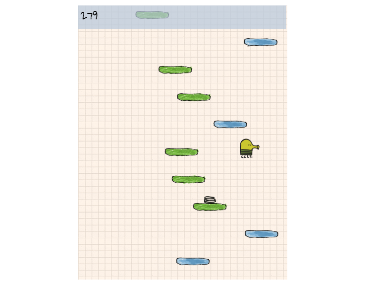

# Description
The gameplay of Doodle Jump is straightforward and easy to understand. The Doodler automatically jumps upward, and players can control its left and right movements by tilting their device or using on-screen controls. The goal is to avoid various obstacles and enemies while ascending as high as possible.

# Expected behavior
As players progress higher, the game becomes increasingly challenging. The platforms become narrower, enemies appear more frequently, and the speed of ascent increases, requiring quick reflexes and precise timing.

# Screenshot
