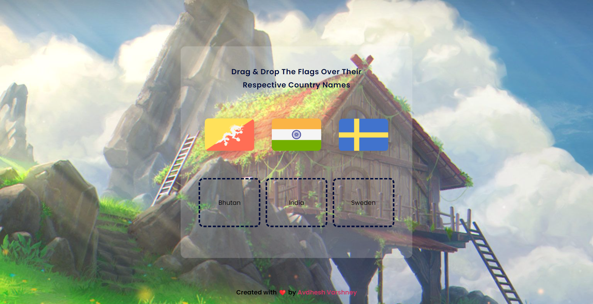

# **Guess The Flag - Game**
---

## **Description 📃** 
- This program is designed to learn the flags of different countries
- So that everyone can identify the flag of different countries and boost your knowledge

## **functionalities** 
- Press the start button to start the game
- Drag the flag of respective country and put into their box
- Finally, enjoy the grand congratulation of winning

 

## **Tech Stack 🎮**
- HTML
- CSS
- JavaScript

 

## **Screenshots 📸**

 

## **Demo Video 📸**

https://github.com/pranjay-poddar/Dev-Geeks/assets/114330097/af5fea86-8b33-4aaa-b06d-50fb0d5f56b1

 

## **Author**

[Avdhesh Varshney](https://github.com/Avdhesh-Varshney)

