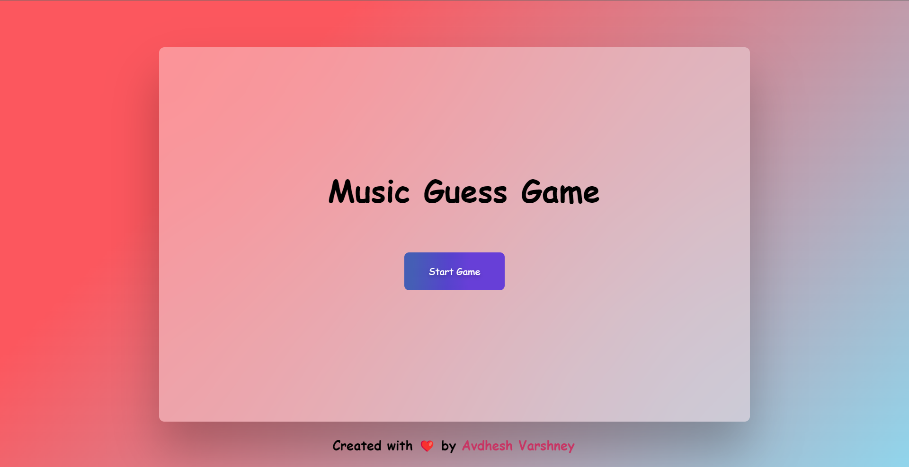
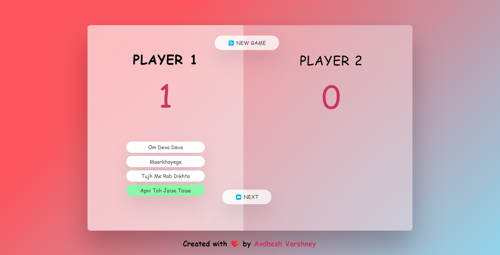

# **Music Guess Game** 

---

 

## **Description 📃** 
- This project is built on a basic web tech stacks such as HTML, CSS and Javascript.
- This game is just for fun.

## **functionalities 🎮** 
- This game is a multi player game.
- Press the 'Start Game' Button to start the game.
- Press next button to switch to the next player.
- Select the option after listening the tune of the song.
- If selected option is correct, score will increase by 1.
- Otherwise, score will decrease by 1.

## ** Additional Features **
- Displaying the current score of the player.
- Implementing a graphical user interface (GUI) for a more interactive experience.
- A song will not repeat until 8 rounds of the songs is not occurred.

 

## **How to play? 🕹️**
- This is a multi player game.
- Pick the correct option will increase your score.
- The player who reaches to 10 points first will the game.

 

## **Screenshots 📸**

 

 

 

## **Working video 📹**
<!-- add your working video over here -->
https://github.com/pranjay-poddar/Dev-Geeks/assets/114330097/2b3e6dbd-9512-4c28-9b14-2c5df84e1f8f
