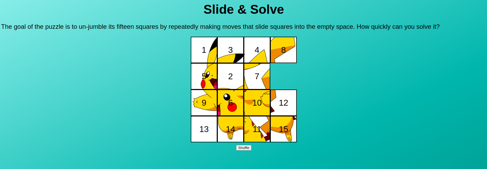

# **Slide & Solve** 

## **Description**
**Roll the dice, seize your fate, and score your way to victory!**

Slide & Solve is a classic sliding puzzle game where the objective is to rearrange the numbered tiles by sliding them into the empty space. The game is implemented using HTML, CSS, and JavaScript.

 

## **Functionalities**

- Random Board Generation: The game can generate a random initial board configuration each time it is played, providing a unique puzzle challenge.

- Move Count: Keep track of the number of moves the player makes to solve the puzzle. Display this count to encourage players to solve the puzzle in the fewest moves possible.

- Game Completion Check: Continuously check the board configuration to determine if the player has successfully solved the puzzle. Provide a congratulatory message or animation when the puzzle is solved.

- Responsive Design: Ensure the game is responsive and can adapt to different screen sizes and orientations, allowing players to enjoy the game on various devices.

 

## **How to play?**

1. The game board consists of a 4x4 grid with fifteen numbered tiles and one empty space.
2. To make a move, click on a tile adjacent to the empty space. The clicked tile will slide into the empty space.
3. The goal is to arrange the tiles in numerical order, from 1 to 15, starting from the top-left corner and leaving the bottom-right cell empty.

 

## **Installation**
1. Clone or download the repository.
2. Open the index.html file in a web browser.

 

## **Screenshots 📸**

 

 

