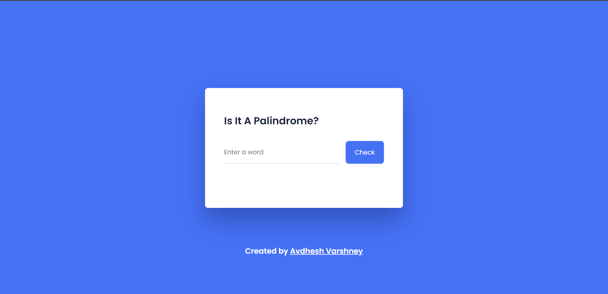

# **Palindrome Checker**
---

## **Description 📃** 
- This program is designed to check whether the entered text is a palindrome or not ?

## **functionalities** 
- Just enter the text in the input box and press the check button for checking.

 

## **Tech Stack 🎮**
- HTML
- CSS
- JavaScript

 

## **Screenshots 📸**

<!-- add your screenshots like this -->

 

## **Author**

[Avdhesh Varshney](https://github.com/Avdhesh-Varshney)

