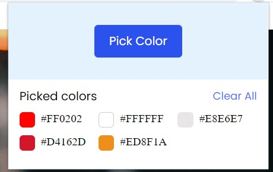

# Chrome Color Picker Extension

A Chrome extension that adds a color picker tool to your browser for convenient color selection.

## Installation

1. Download the source code.
2. Open Google Chrome and go to the Extensions page (`chrome://extensions`).
3. Enable the Developer mode (toggle switch in the top-right corner).
4. Click on "Load unpacked" and select the directory where you cloned/downloaded the source code.
5. The Chrome Color Picker Extension should now be installed and ready to use.

## Usage

1. Click on the extension's icon in the Chrome toolbar to activate the color picker tool.
2. Move your mouse cursor over the desired color and click to select it.
3. The selected color's hex code will be copied to your clipboard automatically.

## Features

- Easy-to-use color picker tool.
- Copy selected color's hex code to the clipboard.
- Seamless integration with the Chrome browser.

## Screenshots

