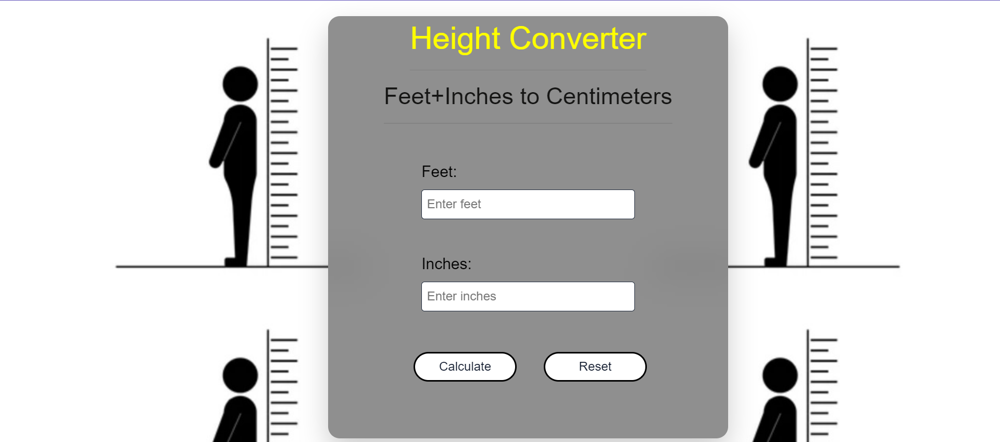

## FAQ Collapse

1. It is a simple JavaScript project, that can be used to convert height from Feet+Inches to Centimeter.  

The Above Project looks like this

You can reset the input values as well.