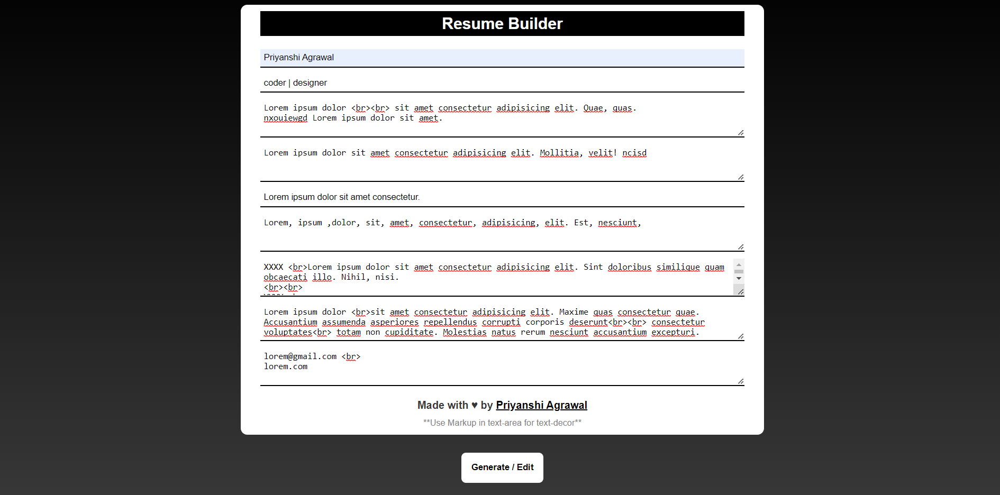
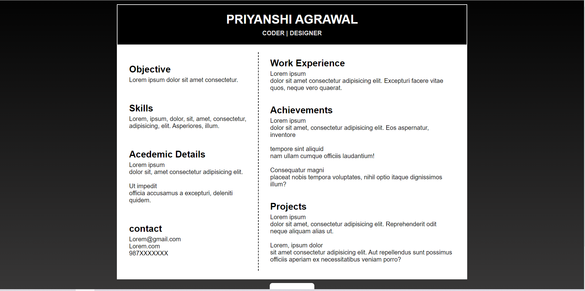
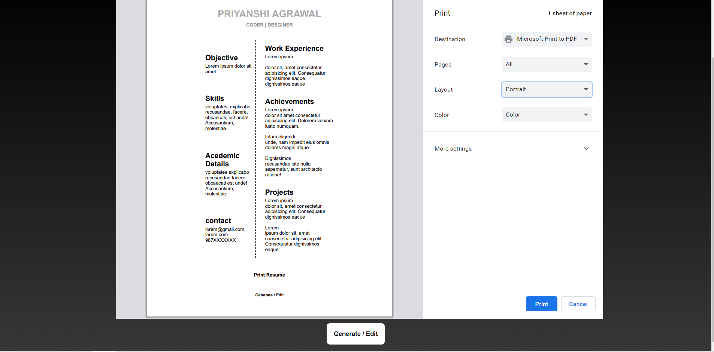

### Resume Builder WebApp
This project lets you generate your resume and you can download it. 
### How to use this?
1. Enter your details in the input fields.

2. Click in generate/edit button.

3. Click on print resume button.

#### you can add markdown tags for formatting text.