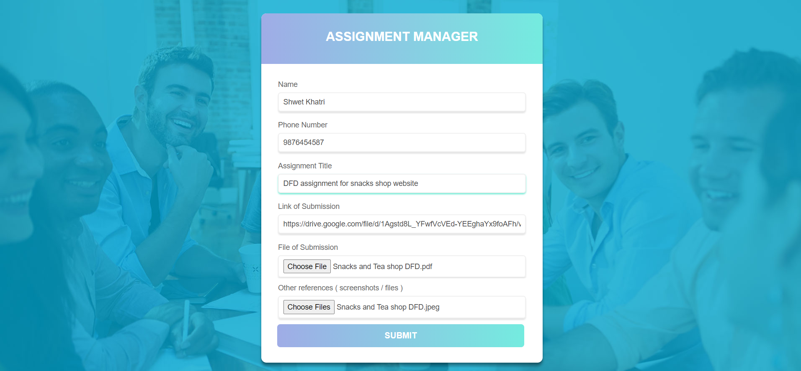

# AssignmentManager

## 🚀 Features

- Manages submissions for assignments for any organization or institution with an interactive ui-ux.
- Long Time saving of Assignments in `Google Cloud` using `MongoDB` as database with easy access and anytime updates.
- Handles different backend and frontend dynamic routes in `React` , `NodeJS` and `ExpressJS`.
- Saves different kind of file submissions using `Multer`.

## :eyes: Preview

[Live Link](https://managemyassignment.herokuapp.com/)

Deployed at [Heroku](https://heroku.com).




## 📥 Installation

Use these commands and follow mentioned steps to get your web app ready with installation.

- First Fork the main repo [pranjay-poddar/Dev-Geeks](https://github.com/pranjay-poddar/Dev-Geeks)

```bash
git clone https://github.com/<your-github-username>/Dev-Geeks.git
```

```bash
cd MERN/Assignment Manager
npm install
```

```bash
cd client
npm install
```

After installations, make a file `.env` in root directory(for this project) and add some env variables there.

- First add `PORT` as port number other then 3000 to handle api requests in server.
- Second add `MONGO_URI` which is the mongodb database link.
  Visit [Mongo DB](https://www.mongodb.com/) and sign up for the free API Key. Then go back to your [Mongo DB](https://www.mongodb.com/) account and must create a database cluster as your server for this application. Here is a [guide](https://docs.mongodb.com/manual/tutorial/atlas-free-tier-setup/) on how to create
- Third one is `NODE_ENV` which could be 'development' or 'production' based on your app status.

Then make another `.env` file in client directory and add one env variable there.

- Add `REACT_APP_PORT` with same port number given in root directory to handle api requests in client.

To run your app use these commands.

```bash
cd ..
npm run dev
```

## 🎁 Contributing

If you find bugs with this project, pull requests are always welcome. You can [create an issue here](https://github.com/pranjay-poddar/Dev-Geeks/issues/new).
Your :star: is also greatly appreciated.

Checkout other awesome projects on my GitHub : [ShwetKhatri2001](https://github.com/ShwetKhatri2001)
