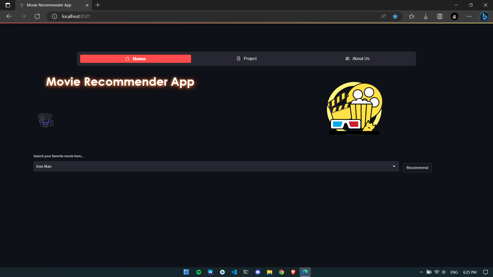
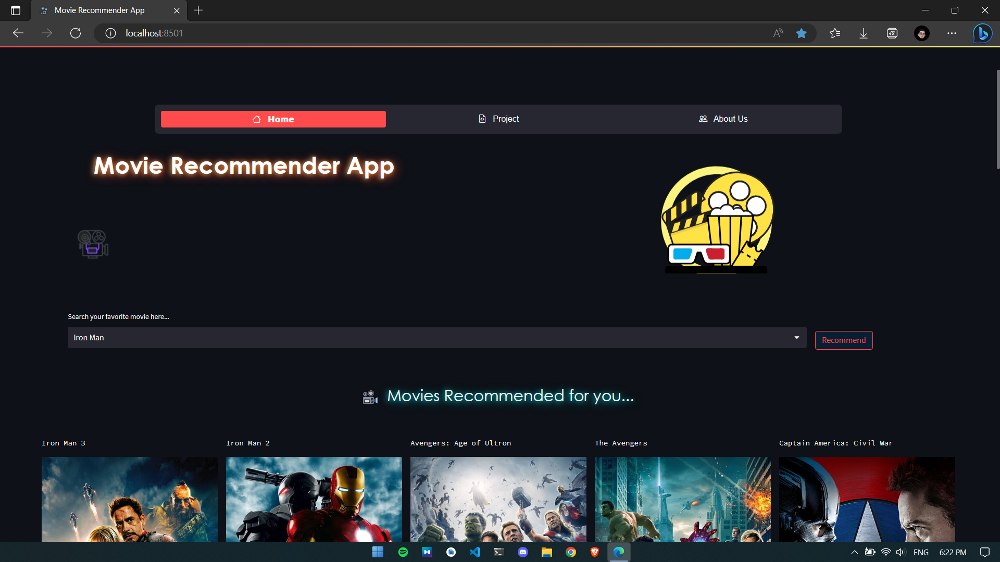
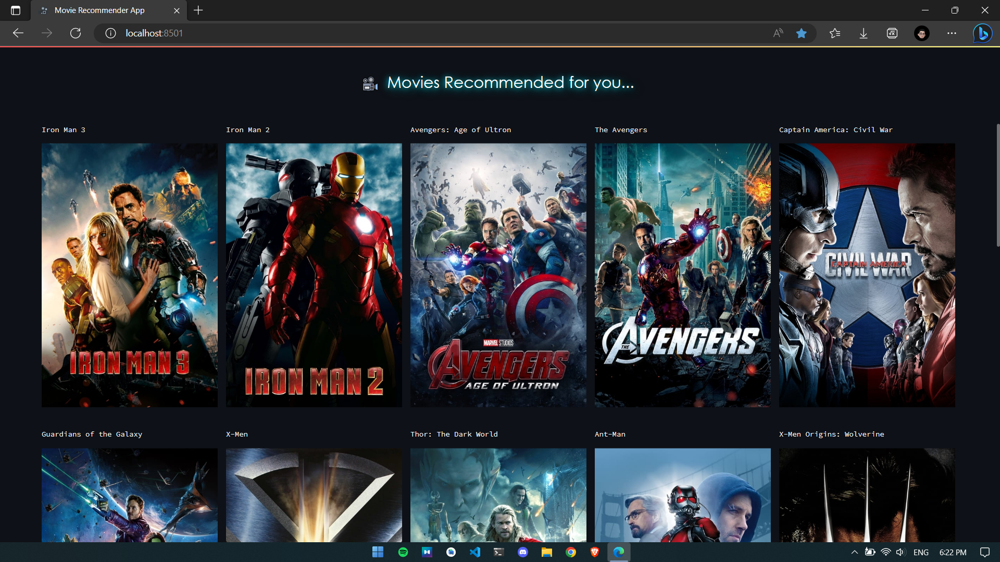
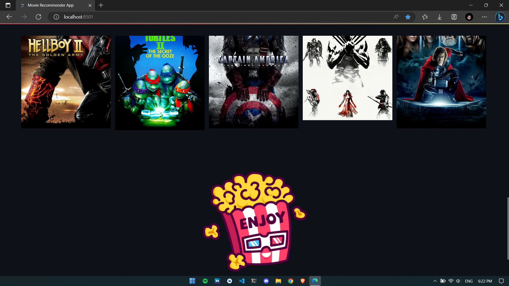

# Recommender-System &nbsp;&nbsp;[](https://docs.streamlit.io/) 

The project is a recommender system that utilizes a specific algorithm for generating personalized recommendations. It is designed to analyze user preferences and make relevant suggestions based on their previous interactions and behavior. The system aims to improve user experience by providing accurate and tailored recommendations, thereby enhancing their engagement with the platform. The project's implementation involves leveraging a tech stack consisting of Python and associated libraries for data processing and machine learning tasks. The recommender system employs sophisticated algorithms and techniques to offer users valuable and personalized recommendations.

## Stack
- Programming Language: Python
- Libraries/Frameworks: Streamlit Pandas, NumPy, Scikit-learn, Pickle, PorterStemmer
- Web Framework: Streamlit
- Machine Learning: Collaborative Filtering, Content-Based Filtering
- Data Analysis: Pandas, NumPy
- Model Evaluation: Scikit-learn
- Development Environment: Jupyter Notebook

## Screenshots
<p float="left">
    
</p>
<p float="left">
    
</p>


## Get dataset
- Get the dataset [here](https://www.kaggle.com/datasets/tmdb/tmdb-movie-metadata)

## Run this project

### Get required files
- Install Python (Dont forget to tick Add to Path while installing Python)
- Clone this project
- Open project directory in terminal and run following commands :
```sh
py -m pip install -r requirements.txt
```

### Generate pickle file
- Run [mrs_main](mrs_main.ipynb)
- Two files will be generated `movie_dict.pkl` and `similarity.pkl`

### Run App
```sh
streamlit run app.py
```

The app will open in you default browser, If not, open your browser and goto `http://localhost:8501`

; )
