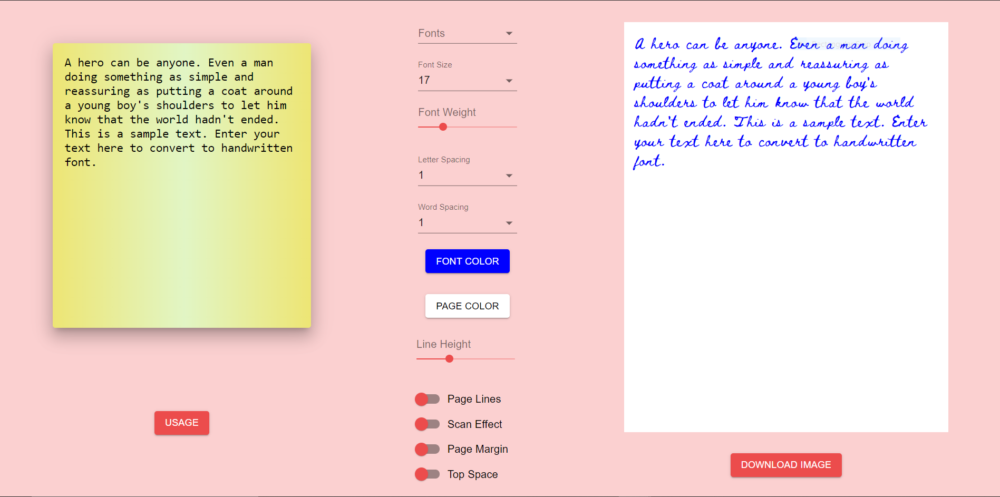
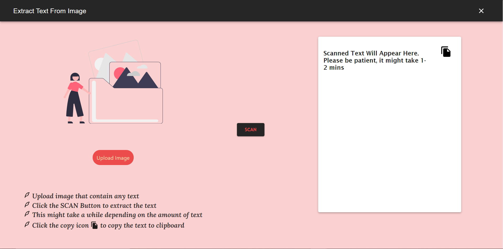
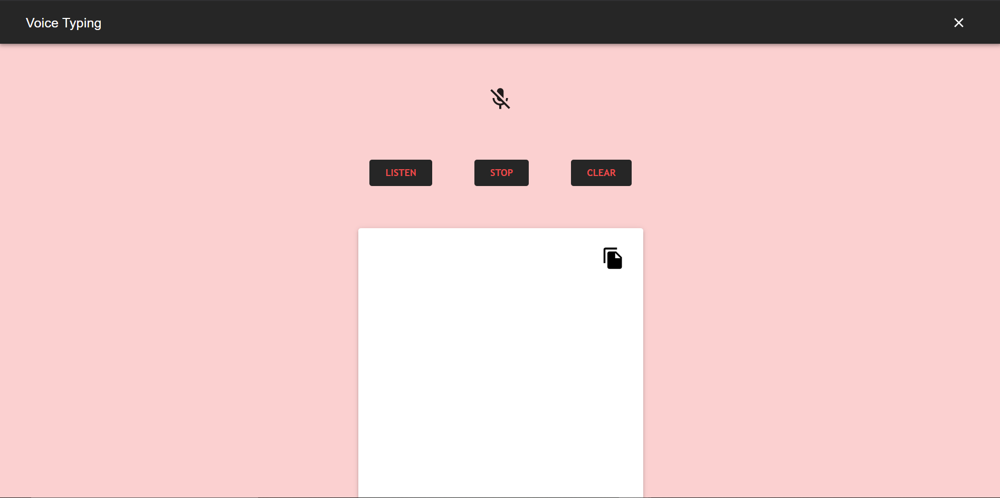

<p  align="center">


</p>

  

# HandReacting


  

Are you tired and fed up of the multitude of written assignments that you have to submit?

### *HandReacting* is the PERFECT solution to all your problems. It converts typed documents into handwritten ones 🖋, saving you a hella lotta time. ⏳

  

<br><br><br>

  
  

<p  align="center">


</p>

## About the Project
HandReacting is an app which allows the user to generate handwritten text in the form of a downloadable image from the input given. It can be used by students to generate their assignments so that they don't have to go through the hassle of writing down everything physically.

The project has been made using React.

## Prerequisites

Required to install and run the software:

-   [npm](https://www.npmjs.com/get-npm)

## Installing and Running
From the project folder, run these commands in console (terminal) to install dependencies and run the app:
```
npm install
npm start
```
Open [http://localhost:3000](http://localhost:3000/) with your browser to see the result.

## Usage Instructions

 - Choose from 34 fonts that looks handwritten
 - Adjust font size to choose number of words in a line
 - Adjust font weight to change boldness of the text
 - Letter spacing and word spacing helps arrange words more closely
 - Change font color and paper page color to get paper like appearance
 - Adjusting line height is important when page lines are enabled
 - Page lines provide lines in the paper
 - Scan effect provides a shadow to the page
 - Page margin gives a margin to the page

## Screenshots

* Converting Text to 34 different handwritten font faces.

<p  align="center">



</p>

<br>

  

* Extracting text from images before converting to various fonts.

<p  align="center">



</p>

<br>

  

* Converting speech to text

<p  align="center">



</p>

  

<br  ><br  ><br  >

