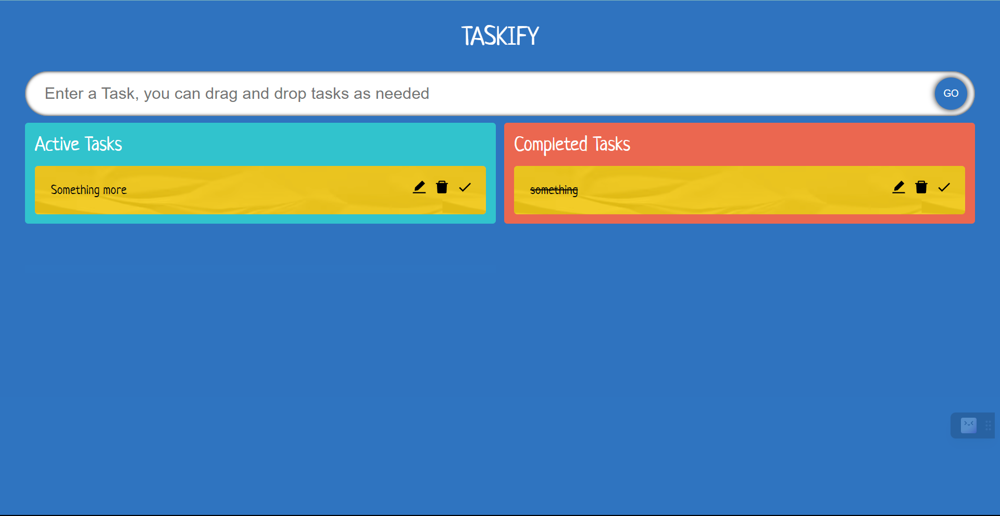

# Getting Started with Create React App

This project was bootstrapped with [Create React App](https://github.com/facebook/create-react-app).

## Available Scripts

In the project directory, you can run:

### `npm start`

Runs the app in the development mode.\
Open [http://localhost:3000](http://localhost:3000) to view it in the browser.

The page will reload if you make edits.\
You will also see any lint errors in the console.

## This Project uses Typescript
Also check the package.json to get more details about the packages used.

## Screenshot

## DEMO

<figure class="video_container">
  <video controls="true" allowfullscreen="true" poster="path/to/poster_image.png">
    <source src="./preview_todo.webm" type="video/webm">
  </video>
</figure>

## Learn More

You can learn more in the [Create React App documentation](https://facebook.github.io/create-react-app/docs/getting-started).

To learn React, check out the [React documentation](https://reactjs.org/).
